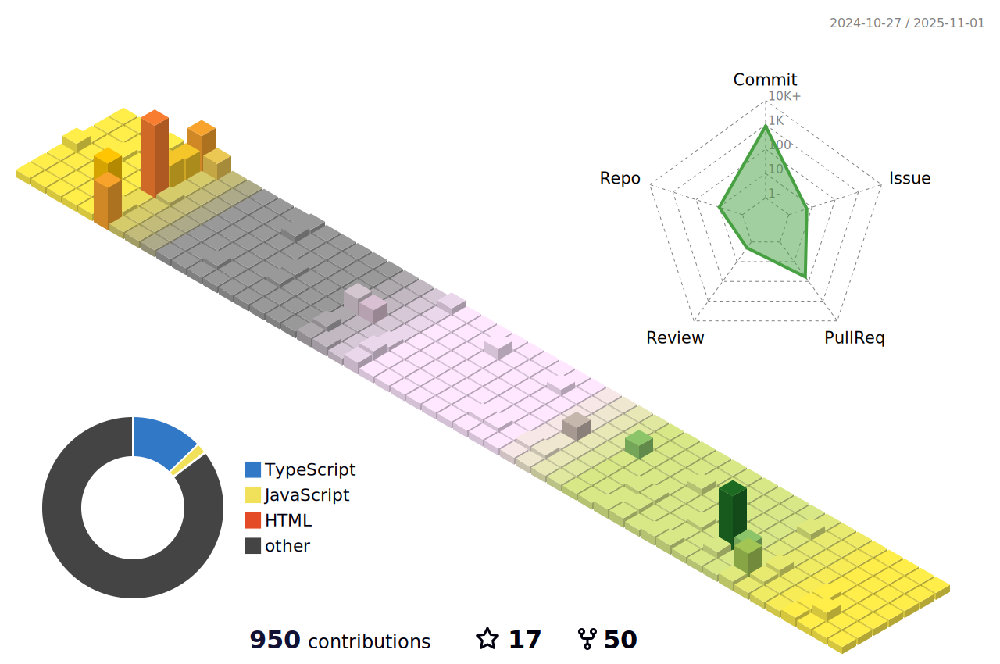

<h1 align="center">नमस्ते (Namaste)🙏🏻, I'm Ankit Raj aka honesthacker! </h1>


<h3 align="center">I'm a Software and Web Developer from India ❤</h3>
A 22 Y/O Software🌈 and Web developer🎯 from India who loves to build, deploy & maintain things for the ☁️ and specializes in building (and occasionally designing) exceptional digital experiences. Meticulous and motivated graduate student indulged in competitive programming.

<h2 align="center">Current & Previous Roles 
</h2>


<table>
  <tr>    
    <th><a href="https://www.plivo.com/"></a></th>
    <th><a href="https://www.hackerearth.com/"></a></th>
    <th><a href="https://www.rtcamp.com/in-en"></a></th>
    <th><a href="https://home.cuchapter.tech/team"></a></th>
  </tr>
  <table>
  <tr>
    <td align="center">These roles make me more motivated to continue what I love and help more people in different communities and also encourage me to create my own community to support my peers in the India. <hr>Find your college chapter: <a href="https://www.codechef.com/college-chapter/member">CodeChef Chapter</a></td>
  </tr>
  </table>
</table>

<hr />

<br>


<div align="center">
 <h1>
  Connect With Me
    
</h1>


[](https://www.linkedin.com/in/ank1traj/)
[](https://www.instagram.com/silent___notes/?hl=en)
[](https://ankit.cuchapter.tech/)
[](https://www.hackerrank.com/coderboy_/)
[](https://www.codechef.com/users/honesthacker/)

<a id="Setmore_button_iframe" style="float:none" href="https://my.setmore.com/bookingpage/3648dafa-a45e-45f7-aeb9-b6862481b7b0" target="_blank"></a><br>
</div>

<br>
<br>

 A little more about me...  


```
const ankit = {
    pronouns: "He" | "Him",
    code: ["Javascript", "C", "Python", "Ruby", "CPP", "HTML", "CSS", "SCSS"],
    askMeAbout: ["web dev", "tech", "cyber security", "writing", "QA", "SDET"],
    technologies: {
        frontEnd: {
            js: ["React", "Next", "Redux", "jQuery"],
            css: ["materialize", "saas", "bootstrap, "materialUI", "Chakra", "Tailwind"]
        },
        backEnd: {
            js: ["node", "express"],
            python: ["django"]
        },
        version control: ["Git", "GitHub", "BitBucket"],
        API: ["REST API"],
        devOps: ["AWS", "Docker🐳", "Route53", "GitHub Actions", "CircleCI"],
        databases: ["mongoDB", "MySQL", "PostgreSQL"],
        misc: ["Firebase", "Socket.IO"],
        testing: ["manual testing", "automation testing", "Selenium", "Jest", "JUnit", "TestNG", 
                  "Maven", "Jenkins", "codeception", "cypress". "PyTest", "mocha"]
    },
    toolsUsing: ["Photoshop", "Illustrator", "XD", "Figma", "InVision", 
                "InDesign", "Dimensions", "CLion", "RubyMine", "GoLand"],
    techCommunities: {
                        Leader: "CU-Coders",
                        speaker: "CU-Coders",
                        graphic-designer: "GirlScript",
                        mentor: "CU-Coders, CGC Landran, Chandigarh University"
                      },
    workplace: {
                company: 'HackerEarth',
                position: 'SDET'         
    },
    architecture: ["Progressive web applications", "Single page applications"],
    currentProject: "I am developing an AI based mentoring system",
    funFact: "There are two ways to write error-free programs; only the third one works",
    availableForHire: true
};
```
- 🌱 I’m currently learning **AWS & Swift** 

- 👯 I’m looking to collaborate on **React, JavaScript, CPP**


- 🤝 I’m looking for help with **JavaScript, HTML, CSS**


- 👨‍💻 All of my projects are available at [GitHub](https://github.com/ank1traj?tab=repositories)

- 💬 Ask me about **Web Development & Competitive Programming**

- 📫 How to reach me **ankit.raj@plivo.com**

- 📄 Know about my experiences [linkedin](https://www.linkedin.com/in/ank1traj/)

- ⚡ Fun fact **Only a quarter of the Sahara Desert is sandy**

 <em><b>I love connecting with different people</b> so if you want to say <b>hi, I'll be happy to meet you more!</b> 😊</em>
<br>


<details>
<summary>🚀 Click on it for some amazing stats</summary>
  

  
<p align="center">
  
</p>


<!---->
<!---->
                                                                                                                


<p align="center">
  <a>
    
    
    
  </a>
</p>

<!--
-->
<br>


<p align="center">
  <a href="https://github.com/ank1traj">
      
  </a>
  <h4 align="center"><code>📊 𝙶𝚒𝚝𝙷𝚞𝚋 𝙼𝚎𝚝𝚛𝚒𝚌𝚜</code></h4>
</p>

<p align="center">
  <a href='https://github.com/ank1traj/'>
    
    
  </a>
</p>

<p align="center">
  
</p>


</details>


<details>
<summary>🚀 Click on it for some coding stats</summary>
  
<!--START_SECTION:waka-->


**🐱 My GitHub Data** 

> 📦 5.6 MB Used in GitHub's Storage 
 > 
> 🏆 110 Contributions in the Year 2025
 > 
> 💼 Opted to Hire
 > 
> 📜 66 Public Repositories 
 > 
> 🔑 24 Private Repositories 
 > 
**I'm an Early 🐤** 

```text
🌞 Morning                11564 commits       ████████░░░░░░░░░░░░░░░░░   30.44 % 
🌆 Daytime                9575 commits        ██████░░░░░░░░░░░░░░░░░░░   25.20 % 
🌃 Evening                11107 commits       ███████░░░░░░░░░░░░░░░░░░   29.24 % 
🌙 Night                  5745 commits        ████░░░░░░░░░░░░░░░░░░░░░   15.12 % 
```
📅 **I'm Most Productive on Saturday** 

```text
Monday                   4398 commits        ███░░░░░░░░░░░░░░░░░░░░░░   11.58 % 
Tuesday                  4616 commits        ███░░░░░░░░░░░░░░░░░░░░░░   12.15 % 
Wednesday                4463 commits        ███░░░░░░░░░░░░░░░░░░░░░░   11.75 % 
Thursday                 4924 commits        ███░░░░░░░░░░░░░░░░░░░░░░   12.96 % 
Friday                   6527 commits        ████░░░░░░░░░░░░░░░░░░░░░   17.18 % 
Saturday                 8193 commits        █████░░░░░░░░░░░░░░░░░░░░   21.57 % 
Sunday                   4870 commits        ███░░░░░░░░░░░░░░░░░░░░░░   12.82 % 
```


📊 **This Week I Spent My Time On** 

```text
🕑︎ Time Zone: Asia/Kolkata

💬 Programming Languages: 
JavaScript               6 hrs 47 mins       ████████████████████████░   95.12 % 
YAML                     20 mins             █░░░░░░░░░░░░░░░░░░░░░░░░   04.77 % 
GraphQL                  0 secs              ░░░░░░░░░░░░░░░░░░░░░░░░░   00.11 % 
Image (svg)              0 secs              ░░░░░░░░░░░░░░░░░░░░░░░░░   00.01 % 
.env file                0 secs              ░░░░░░░░░░░░░░░░░░░░░░░░░   00.00 % 

🔥 Editors: 
Aqua                     7 hrs 8 mins        █████████████████████████   100.00 % 

💻 Operating System: 
Mac                      7 hrs 8 mins        █████████████████████████   100.00 % 
```

**I Mostly Code in JavaScript** 

```text
JavaScript               33 repos            █████████████░░░░░░░░░░░░   51.56 % 
HTML                     11 repos            ████░░░░░░░░░░░░░░░░░░░░░   17.19 % 
TypeScript               6 repos             ██░░░░░░░░░░░░░░░░░░░░░░░   09.38 % 
Python                   3 repos             █░░░░░░░░░░░░░░░░░░░░░░░░   04.69 % 
Go                       1 repo              ░░░░░░░░░░░░░░░░░░░░░░░░░   01.56 % 
```


**Timeline**


 Last Updated on 22/02/2025 00:48:30 UTC
<!--END_SECTION:waka-->
</details>

---


### Spotify Playing 🎧
[](https://open.spotify.com/playlist/5udVMvLsxxkCgJahBsPnyH?si=3ce4a39b80f94813)
---
<p align="center">
  <a href="https://archiveprogram.github.com/">
    
  </a>
</p>
<div align="center">

### 𝚂𝚑𝚘𝚠 𝚜𝚘𝚖𝚎 ❤️ 𝚋𝚢 𝚜𝚝𝚊𝚛𝚛𝚒𝚗𝚐 𝚜𝚘𝚖𝚎 𝚘𝚏 𝚝𝚑𝚎 𝚛𝚎𝚙𝚘𝚜𝚒𝚝𝚘𝚛𝚒𝚎𝚜!
<!--
 <p align="center"> 
    
    
     
     </p>-->
</div>


<br>
<!--<div align="center">
  

</div>-->


<!--
**ank1traj/ank1traj** is a ✨ _special_ ✨ repository because its `README.md` (this file) appears on your GitHub profile.
Here are some ideas to get you started:

- 🔭 I’m currently working on ...
- 🌱 I’m currently learning ...
- 👯 I’m looking to collaborate on ...
- 🤔 I’m looking for help with ...
- 💬 Ask me about ...
- 📫 How to reach me: ...
- 😄 Pronouns: ...
- ⚡ Fun fact: ...


### Made with ❤ by Ankit Raj
